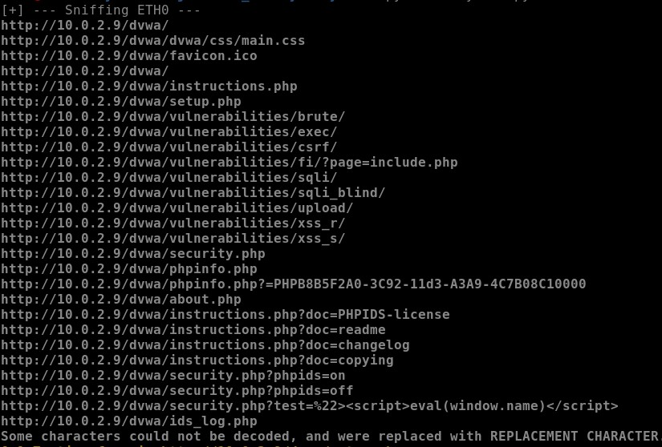

# CryWolf

_(by - Aryan Chandrakar **18BCI0174**)_

_[Refer [here](https://github.com/aryanchandrakar/System-Accessor) for system accessor]_

The structure developed is based on a usual website crawler that in general would just be fetching all the hyperlinks and reference to and from that website, on the top of it, a dynamic accessor has been formed to test these links on separate basis for various possible ways of compromises, which can be further appended based on the needs and wants of the user. And taking the suggestion from the [Cranor’s work](https://www.usenix.org/legacy/event/sec09/tech/full_papers/sec09_browser.pdf) the usability ratio of the warning has been tried to improve for better user understanding and keep them away from such malicious weblinks as shown in the figure below.

The scanner executes to firstly validate the SSL certificate of these links prior to any further action. Once the SSL certificate is verified the tests are performed on each of the links and forms on the website, and without any further delay in case of a vulnerable area the alert is sent to the user with a virtually developed method of warning the user, on the side of which the code itself works to take the user to safer platform by both closing the current browser, raising a proper alert formed with keeping usability ratio in mind and allowing user to either learn more about the issue or close the same, while on the other hand if no issues are found user are allowed a proper safe surfing.

## Implementation
### Import Libraries
Import the required libraries using `pip3 install [library_name]`

Required libraries-
* scapy
* requests
* bs4
* colorma
* urllib
* re
* webbrowser
* signal

### Changes for testing wanted websites
Can use these websites or as per your need, append the areas in the code as following-
* _**links_to_ignore**_ - in [`Crywolf.py`](CryWolf.py), append the same with the links of websites' logout page URLs.
* **_data_dict_** - in [`Crywolf.py`](CryWolf.py), append or edit with the username and password of the highest and lowset privileged users of the website to perform vulnerability trest at all levels.
* _**vuln_scanner.session.post(site,data)**_ - in [`Crywolf.py`](CryWolf.py), change or append the site with the login page URL of the testing website.
* _**sniff(interface)**_ - in [`Crywolf.py`](CryWolf.py), change interface on which sniffing the packets for URL.

### Adding vulnerability checks
The code currently checks for XSS, SQLi vulnerabilities and SSL certificates. One can add vulnerability checks as per need by adding function in the [scanner code](scanner_python3.py) as -

    def test_vulnerability_in_link(self,url):

        vulnerability_test_script="add_payload_here"

        url=url.replace("=","="+vulnerability_test_script)

        response=self.session.get(url)

        return  vulnerability_test_script.encode() in response.content

    def vulnerability_in_form(self,form,url):

        vulnerability_test_script="payload"

        response=self.submit_for(form,vulnerability_test_script,url)

        return vulnerability_test_script.encode() in response.content

_(The functions and code represented above are just for reference, they might vary as per the vulnerability check performed for.)_

### Running CryWolf
1. Open a terminal and a browser on the same system, in case sniffing on different interface, the webite can be opened on other device on that network and terminal runs on another system (this requires usage of network adapter). 
2. Open the directory where the code is saved on your terminal and run the code using `python3 CryWolf.py`.
3. This gives a text on screen as _[+] --- Sniffing [interface_name] ---_
4. The user can further go on surfing the websites as per the want.
5. In case a vulnerability is detected on the website or any hyperlink it contains the user is alerted on the browser itself.

## OUTPUT
As the scanner runs the crawler's output can be seen fetching all the URL surfed from the packet and hyperlinks in that URL.

In case a vulnerability is detected the user is alert both on the terminal and brwoser.

The difference being the terminal points to the exact location where the vulnerability was found while the brwoser alert just safegurad the user.

#### Terminal alerts - 
* [SQLi Vulnerability alert](https://github.com/aryanchandrakar/CryWolf/blob/d9b4f4f67d961ad5a4ba4bd73918f2806e98c2f4/OUTPUT/sql%20vuln.jpg)
* [XSS Vulnearbility alert](https://github.com/aryanchandrakar/CryWolf/blob/d9b4f4f67d961ad5a4ba4bd73918f2806e98c2f4/OUTPUT/xss%20vuln.jpg)
* [Invalid SSL certi. alert](https://github.com/aryanchandrakar/CryWolf/blob/d9b4f4f67d961ad5a4ba4bd73918f2806e98c2f4/OUTPUT/SSL_checker.jpg)

### Browser alerts-
* [SQLi Vulnerability alert](https://github.com/aryanchandrakar/CryWolf/blob/d9b4f4f67d961ad5a4ba4bd73918f2806e98c2f4/OUTPUT/sql%20alert.jpg)
* [XSS Vulnearbility alert](https://github.com/aryanchandrakar/CryWolf/blob/d9b4f4f67d961ad5a4ba4bd73918f2806e98c2f4/OUTPUT/XSS%20alert.jpg)
* [Invalid SSL certi. alert](https://github.com/aryanchandrakar/CryWolf/blob/d9b4f4f67d961ad5a4ba4bd73918f2806e98c2f4/OUTPUT/SSL%20alert.jpg)
   
## Analysis
10 different speed tests for each without & with Crywolf running in background were done, the result was a **slight increase of latency of about 1.6 millisecond** when surfing the web while an **increase in retransmission rate of 0.4%** was seen. The upload and download speed were affected negligible too, with an **alteration of about 0.397 Mb/s for the download and 0.049 Mb/s for the upload speed** when the script was running.

While when these vulnerable sites were accessed on the system, none of the browser showed any sign of alert or warning for user to be cautious, the only display of any warning was in the address bar with a change in padlock icon in-front of the URL, which showed no alert unless being clicked upon, whereas on the other hand all such warnings and alert were displayed separately to the user developed to alert them about all necessary issues and potential threat.

# References
[Reference + Initial Idea](https://www.usenix.org/legacy/event/sec09/tech/full_papers/sec09_browser.pdf)
